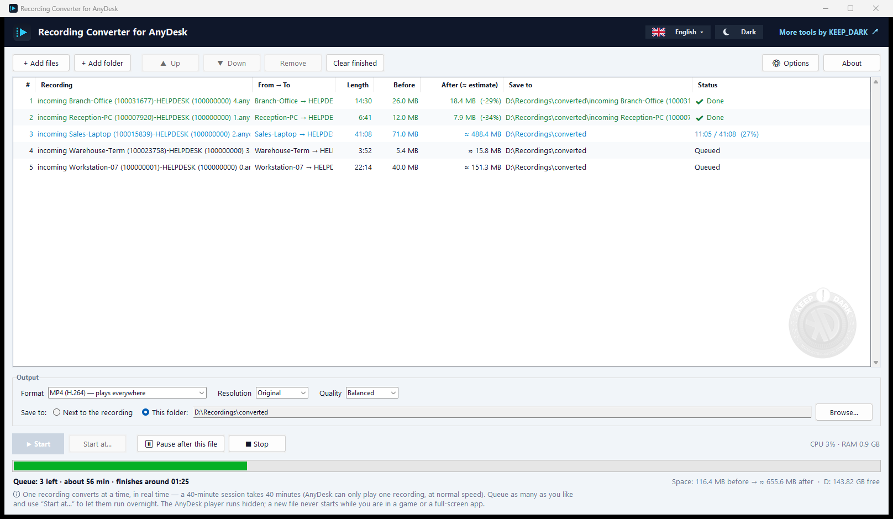
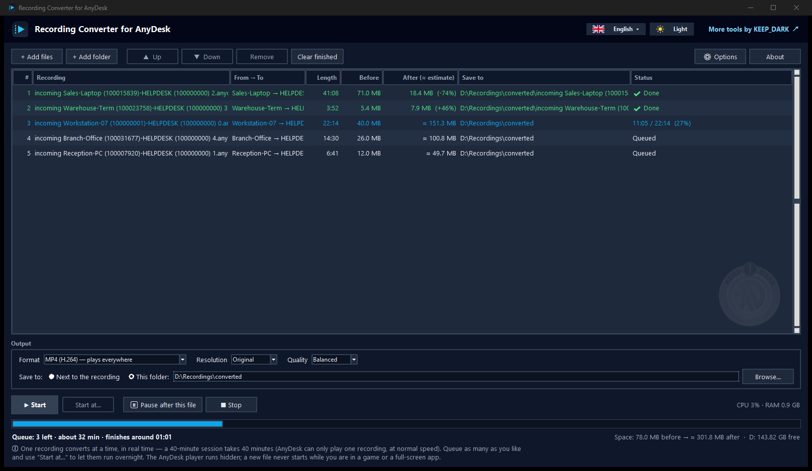
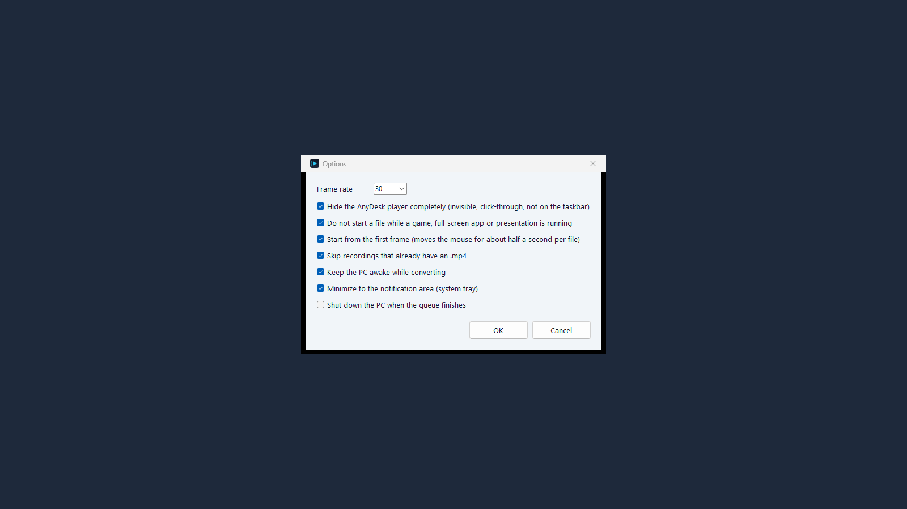
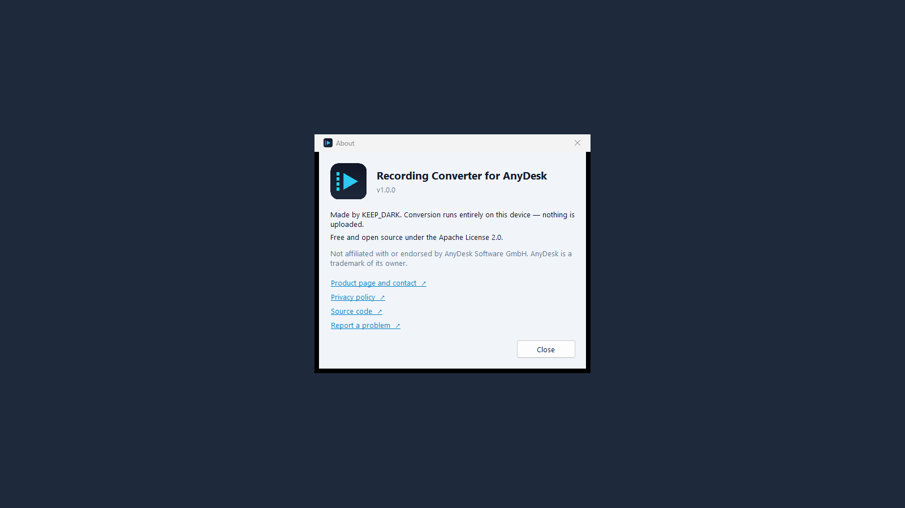

# Recording Converter for AnyDesk

Turn AnyDesk session recordings (`.anydesk`) into ordinary `.mp4` videos you can play,
share, or archive anywhere.

AnyDesk can only play its recordings inside its own client and offers no export. This tool
automates the one approach that works: it asks your installed AnyDesk to play the recording,
captures just the picture area with FFmpeg, and writes an MP4 — hands-free, queued, and in the
background.

**Free and open source, by [KEEP_DARK](https://www.keep-dark.com/works/recording-converter-for-anydesk/).**
Everything runs on your PC. Nothing is uploaded.

[ภาษาไทย](README.th.md)

> Not affiliated with or endorsed by AnyDesk Software GmbH. "AnyDesk" is a trademark of its
> owner and is used only to describe what this tool works with. This project does not contain,
> modify, or redistribute any AnyDesk software.



## What you get

- A queue window: add files or a whole folder, see who connected to whom and how long each
  recording is *before* converting, then press Start.
- Stays out of your way: the AnyDesk player runs invisible (transparent, click-through,
  not on the taskbar or Alt+Tab) and keyboard focus comes straight back to you.
- Never starts a new file while a game, a full-screen app or a presentation is running -
  the start of a file is the only moment a conversion could interrupt you.
- Picture cropped to the recorded screen at 1:1 — no player chrome, no black borders.
- Choose the result: MP4 (H.264 or H.265), MKV, MOV or WebM, at the original resolution or
  scaled to 2160p / 1440p / 1080p / 720p / 480p, in three quality levels.
- One destination for everything, or a different folder per recording (right-click a row).
- A real queue: reorder, remove, retry, pause after the current file, stop and keep what
  was recorded. The list survives closing the app.
- Start at a set time, e.g. overnight.
- Minimizes to the notification area (system tray) with progress in the tooltip and a
  notice when the queue is done.
- Live CPU / RAM usage and an estimate of when the queue will finish.
- Optional: keep the PC awake, shut down when finished.
- English, ไทย, 简体中文 — adding a language is one JSON file in `locales/`.
- A command line for scripting and batch jobs.

## Requirements

- Windows 10 or 11
- AnyDesk installed (tested with 5.4.2 and 9.7.15)
- Python 3.10+ (standard library only, nothing to `pip install`)
- `ffmpeg` and `ffprobe` on `PATH` (NVIDIA NVENC is used when available, otherwise libx264)

## Quick start

```powershell
# one-time: adds "Convert to MP4" to the right-click menu of .anydesk files
# and a desktop shortcut
python anydesk2mp4.py --install
```

Then either

1. right-click one or more `.anydesk` files → **Convert to MP4**
   (Windows 11: under *Show more options*), or
2. open **Recording Converter for AnyDesk** from the desktop and add or drop files.

All selected files land in one window and convert one after another.
Remove the menu entry and shortcut again with `--uninstall`.

## Command line

```powershell
python anydesk2mp4.py "C:\Recordings\session 0.anydesk"          # MP4 next to the source
python anydesk2mp4.py "C:\Recordings" -o D:\Videos                # a whole folder
python anydesk2mp4.py --info "C:\Recordings\*.anydesk"            # peers, size, length only
```

| Option | Meaning |
|---|---|
| `-o DIR` | output folder (default: next to the source) |
| `--format F` | `mp4` (default), `mp4-hevc`, `mkv`, `mov`, `webm` |
| `--max-height PX` | scale down to at most this many lines, e.g. `1080` |
| `--fps N` | frame rate (30) |
| `--cq N` | quality, lower is better and larger (23) |
| `--overwrite` | convert again even if the `.mp4` exists |
| `--no-rewind` | never touch the mouse; the first seconds of the recording are lost |
| `--visible` | show the AnyDesk player instead of hiding it |
| `--ignore-busy` | start files even while a game or full-screen app is running |
| `--no-crop` | keep the whole playback view |
| `--duration SEC` | override the length read from the file |
| `--json` | print one JSON progress event per line (used by the window) |

Press `Ctrl+C` to stop; what was recorded so far is kept as a playable MP4.

## Good to know

- **It takes as long as the recording is.** AnyDesk plays back in real time, so a 40-minute
  session takes 40 minutes. The queue shows the total before you start.
- **Why the player is made invisible rather than minimized.** Windows stops drawing a
  minimized, hidden or off-screen window, so there would be nothing to capture. A window
  that is 99.6 % transparent is still drawn - and you cannot see or click it. Use
  `--visible` (or the option in the window) to watch it play instead.
- **The mouse moves by itself for about half a second per file.** That is a real click on the
  player's "restart" button so the video begins at the first frame; AnyDesk ignores the same
  command sent any other way. Turn it off in Options (or `--no-rewind`) if you prefer.
- AnyDesk shows recordings at 1:1 at most. A session larger than your screen is scaled to
  fit, and anything wider than 4096 px is scaled to 4096 (the H.264 limit) — pick
  MP4 (H.265) to keep ultra-wide screens at full width.
- If the recorded resolution changes mid-session, cropping follows the first one — use
  `--no-crop` if the picture gets cut.
- Recordings carry no sound.
- One conversion runs at a time; extra launches wait their turn.

### Working around the AnyDesk player

| Player behaviour | What this tool does |
|---|---|
| 5.x crashes when told to restart before it decoded the first picture | reads when the first picture occurs and waits past it |
| 5.x occasionally crashes or loses its window on start | detects it, closes the crash dialog it caused, retries up to 3 times |
| 5.x minimizes itself when the window fills the screen | never sizes it to the full work area; restores before clicking |
| the restart click sometimes does nothing | confirms through AnyDesk's own log and clicks again |
| 7+ overlays its control bar on the bottom of the picture | makes the window taller so the picture clears the bar |

## Privacy

[Privacy policy](https://www.keep-dark.com/works/recording-converter-for-anydesk/privacy/) — the app makes no network connections.
A session recording shows someone's screen. Make sure you are allowed to keep and share it.
This tool reads the recording, AnyDesk's local log file (to confirm the restart), and writes
the MP4. It makes no network connections.

## Project layout

| File | Role |
|---|---|
| `gui.py`, `tray.py` | queue window, notification-area icon |
| `anydesk2mp4.py` | converter and command line |
| `adrec.py` | reads peers, resolution and length from a recording's header |
| `capture.py` | FFmpeg control: records to `.mkv`, then remuxes to `.mp4` so an interrupted run still yields a valid file |
| `win32util.py`, `procstats.py` | window handling and usage metering via `ctypes` |
| `shellmenu.py` | right-click entry, shortcut, cross-process queue |
| `i18n.py`, `locales/` | translations |

## Screenshots

| | |
|---|---|
|  |  |
|  |  |

## License

[Apache License 2.0](LICENSE). Keep the [NOTICE](NOTICE) file with any copy or derivative.
The KEEP_DARK name and logo are not covered by the license.
