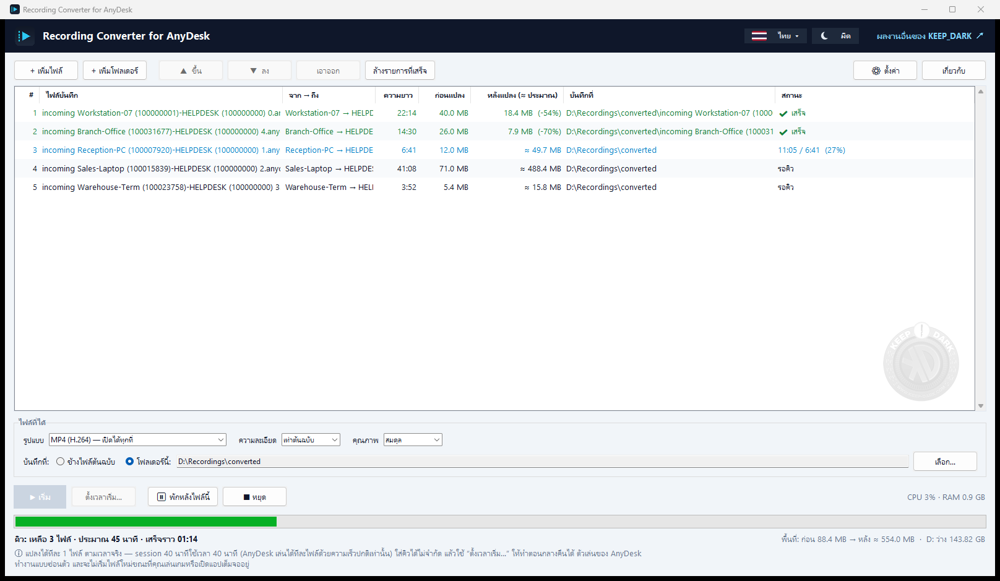

# Recording Converter for AnyDesk

แปลงไฟล์บันทึก session ของ AnyDesk (`.anydesk`) เป็นวิดีโอ `.mp4` ธรรมดา ที่เปิดดู ส่งต่อ หรือเก็บเป็นหลักฐานได้ทุกที่

AnyDesk เล่นไฟล์บันทึกได้เฉพาะในโปรแกรมของตัวเองและไม่มีปุ่ม export โปรแกรมนี้จึงทำสิ่งเดียวที่ได้ผลให้เป็นอัตโนมัติ:
สั่งให้ AnyDesk ที่ติดตั้งอยู่เล่นไฟล์ แล้วให้ FFmpeg จับเฉพาะพื้นที่ภาพ เขียนออกมาเป็น MP4 —
ไม่ต้องกดอะไร ทำเป็นคิวได้ และทำงานอยู่เบื้องหลัง

**ฟรีและเปิดซอร์ส โดย [KEEP_DARK](https://www.keep-dark.com/works/recording-converter-for-anydesk/)**
ทุกอย่างทำงานในเครื่องของคุณ ไม่มีการอัปโหลดใด ๆ

[English](README.md)

> ไม่มีส่วนเกี่ยวข้องและไม่ได้รับการรับรองจาก AnyDesk Software GmbH — "AnyDesk" เป็นเครื่องหมายการค้าของเจ้าของ
> ใช้ในที่นี้เพื่อบอกว่าโปรแกรมนี้ทำงานร่วมกับอะไรเท่านั้น โครงการนี้ไม่ได้บรรจุ ดัดแปลง หรือแจกจ่ายซอฟต์แวร์ของ AnyDesk



## สิ่งที่ได้

- หน้าต่างคิว: เพิ่มไฟล์หรือทั้งโฟลเดอร์ เห็นว่าใครต่อกับใครและยาวเท่าไร *ก่อน* แปลง แล้วกด เริ่ม
- ไม่รบกวน: ตัวเล่นของ AnyDesk ทำงานแบบล่องหน (โปร่งใส คลิกทะลุ ไม่ขึ้น taskbar และ Alt+Tab)
  และ focus คีย์บอร์ดกลับมาหาคุณทันที
- ไม่เริ่มไฟล์ใหม่ขณะที่เล่นเกม เปิดแอปเต็มจอ หรือนำเสนองานอยู่ — จังหวะเริ่มไฟล์คือจังหวะเดียวที่การแปลงอาจขัดจังหวะคุณได้
- ภาพถูกตัดให้พอดีหน้าจอที่ถูกบันทึกแบบ 1:1 — ไม่ติดแถบเมนูของตัวเล่น ไม่มีขอบดำ
- เลือกไฟล์ที่ได้: MP4 (H.264 หรือ H.265), MKV, MOV หรือ WebM ที่ความละเอียดเท่าต้นฉบับ
  หรือย่อเป็น 2160p / 1440p / 1080p / 720p / 480p และคุณภาพ 3 ระดับ
- ปลายทางเดียวสำหรับทุกไฟล์ หรือแยกโฟลเดอร์รายไฟล์ (คลิกขวาที่แถว)
- คิวจริง: จัดลำดับ เอาออก ลองใหม่ พักหลังไฟล์ปัจจุบัน หยุดแล้วเก็บส่วนที่อัดไปแล้ว — ปิดโปรแกรมแล้วคิวยังอยู่
- ตั้งเวลาเริ่มได้ เช่น ให้ทำตอนกลางคืน
- ย่อแล้วไปอยู่ที่ system tray พร้อมความคืบหน้าใน tooltip และแจ้งเตือนเมื่อคิวเสร็จ
- แสดง CPU / RAM ที่ใช้ และเวลาที่คิวจะเสร็จโดยประมาณ
- เลือกได้: กันเครื่องพักระหว่างแปลง, ปิดเครื่องเมื่อคิวเสร็จ
- ภาษา English, ไทย, 简体中文 — เพิ่มภาษา = เพิ่มไฟล์ JSON หนึ่งไฟล์ใน `locales/`
- มี command line สำหรับงานสคริปต์และงานชุด

## ต้องมี

- Windows 10 หรือ 11
- AnyDesk ติดตั้งไว้ (ทดสอบกับ 5.4.2 และ 9.7.15)
- Python 3.10+ (ใช้ standard library ล้วน ไม่ต้อง `pip install`)
- `ffmpeg` และ `ffprobe` ใน `PATH` (มีการ์ด NVIDIA จะใช้ NVENC ไม่มีก็ใช้ libx264)

## เริ่มใช้งาน

```powershell
# ครั้งเดียว: เพิ่มเมนู "Convert to MP4" ตอนคลิกขวาไฟล์ .anydesk และไอคอนบน Desktop
python anydesk2mp4.py --install
```

จากนั้น

1. คลิกขวาที่ไฟล์ `.anydesk` (กี่ไฟล์ก็ได้) → **Convert to MP4** (Windows 11: อยู่ใน *Show more options*) หรือ
2. เปิด **Recording Converter for AnyDesk** จาก Desktop แล้วเพิ่มหรือลากไฟล์มาวาง

ไฟล์ที่เลือกทั้งหมดจะเข้าหน้าต่างเดียว และแปลงต่อกันทีละไฟล์ ถอนเมนูและไอคอนออกด้วย `--uninstall`

## Command line

```powershell
python anydesk2mp4.py "C:\Recordings\session 0.anydesk"          # ได้ MP4 ข้างไฟล์ต้นฉบับ
python anydesk2mp4.py "C:\Recordings" -o D:\Videos                # ทั้งโฟลเดอร์
python anydesk2mp4.py --info "C:\Recordings\*.anydesk"            # ดูข้อมูลอย่างเดียว ไม่แปลง
```

| option | ความหมาย |
|---|---|
| `-o DIR` | โฟลเดอร์ปลายทาง (ค่าเริ่มต้น: ข้างไฟล์ต้นฉบับ) |
| `--format F` | `mp4` (ค่าเริ่มต้น), `mp4-hevc`, `mkv`, `mov`, `webm` |
| `--max-height PX` | ย่อให้สูงไม่เกินค่านี้ เช่น `1080` |
| `--fps N` | เฟรมเรต (30) |
| `--cq N` | คุณภาพ ยิ่งน้อยยิ่งชัดและไฟล์ใหญ่ (23) |
| `--overwrite` | แปลงซ้ำแม้มี `.mp4` อยู่แล้ว |
| `--no-rewind` | ไม่แตะเมาส์เลย แลกกับช่วงวินาทีแรกของไฟล์บันทึกที่หายไป |
| `--visible` | แสดงตัวเล่นของ AnyDesk แทนการซ่อน |
| `--ignore-busy` | เริ่มไฟล์แม้กำลังเล่นเกมหรือเปิดแอปเต็มจอ |
| `--no-crop` | เก็บทั้งพื้นที่ของตัวเล่น |
| `--duration SEC` | กำหนดความยาวเอง แทนค่าที่อ่านจากไฟล์ |
| `--json` | พิมพ์สถานะเป็น JSON ทีละบรรทัด (หน้าต่างใช้ตัวนี้) |

กด `Ctrl+C` เพื่อหยุด ส่วนที่อัดไปแล้วจะถูกเก็บเป็น MP4 ที่เล่นได้

## ควรรู้

- **ใช้เวลาเท่าความยาวของไฟล์บันทึก** AnyDesk เล่นตามเวลาจริง session 40 นาทีก็ใช้ 40 นาที หน้าต่างคิวจะบอกเวลารวมก่อนเริ่ม
- **ทำไมใช้วิธีทำให้ตัวเล่นล่องหน ไม่ใช่ย่อเก็บ** Windows ไม่วาดหน้าต่างที่ถูกย่อ ซ่อน หรืออยู่นอกจอ จึงไม่มีภาพให้จับ
  แต่หน้าต่างที่โปร่งใส 99.6% ยังถูกวาดตามปกติ — โดยที่คุณมองไม่เห็นและคลิกไม่โดน
  ถ้าอยากดูมันเล่น ใช้ `--visible` (หรือปิดตัวเลือกในหน้าต่างตั้งค่า)
- **เมาส์จะขยับเองราวครึ่งวินาทีต่อไฟล์** เป็นการคลิกจริงที่ปุ่ม "เริ่มใหม่" ของตัวเล่น เพื่อให้วิดีโอเริ่มจากเฟรมแรก
  (AnyDesk ไม่รับคำสั่งนี้ทางอื่น) ปิดได้ในตั้งค่า หรือใช้ `--no-rewind`
- AnyDesk แสดงภาพสูงสุดที่ 1:1 — session ที่ใหญ่กว่าจอจะถูกย่อให้พอดี และที่กว้างเกิน 4096px จะถูกย่อเหลือ 4096 (ข้อจำกัดของ H.264) — เลือก MP4 (H.265) ถ้าต้องการเก็บจอกว้างพิเศษเต็มขนาด
- ถ้าความละเอียดเปลี่ยนกลาง session การตัดภาพจะอิงค่าแรก — ใช้ `--no-crop` ถ้าภาพถูกตัด
- ไฟล์บันทึกไม่มีเสียง
- แปลงได้ทีละไฟล์ การสั่งซ้อนจะรอคิว

### การรับมือกับตัวเล่นของ AnyDesk

| พฤติกรรมของตัวเล่น | สิ่งที่โปรแกรมทำ |
|---|---|
| 5.x crash ถ้าสั่งเริ่มใหม่ก่อนถอดภาพเฟรมแรก | อ่านเวลาของภาพแรกจากไฟล์ แล้วรอให้เลยจุดนั้น |
| 5.x crash หรือหน้าต่างหายเองตอนเริ่มเป็นบางครั้ง | ตรวจจับ ปิด dialog crash ที่เกิดจากรอบนั้น แล้วลองใหม่สูงสุด 3 ครั้ง |
| 5.x ย่อหน้าต่างตัวเองเมื่อหน้าต่างกินเต็มจอ | ไม่ขยายเต็มพื้นที่จอ และคืนหน้าต่างก่อนคลิกเสมอ |
| คลิกเริ่มใหม่แล้วบางครั้งไม่ทำงาน | ยืนยันผลจาก log ของ AnyDesk เอง แล้วคลิกซ้ำ |
| 7+ วางแถบควบคุมทับขอบล่างของภาพ | เผื่อความสูงหน้าต่างให้ภาพพ้นแถบ |

## ความเป็นส่วนตัว

[นโยบายความเป็นส่วนตัว](https://www.keep-dark.com/works/recording-converter-for-anydesk/privacy/) — โปรแกรมไม่เชื่อมต่อเครือข่ายใด ๆ
ไฟล์บันทึก session คือภาพหน้าจอของใครบางคน ตรวจให้แน่ใจว่าคุณมีสิทธิ์เก็บและส่งต่อ
โปรแกรมนี้อ่านไฟล์บันทึก อ่าน log ของ AnyDesk ในเครื่อง (เพื่อยืนยันการเริ่มใหม่) และเขียนไฟล์ MP4 เท่านั้น ไม่มีการเชื่อมต่อเครือข่าย

## License

[Apache License 2.0](LICENSE) — ต้องคงไฟล์ [NOTICE](NOTICE) ไว้กับสำเนาหรืองานดัดแปลงทุกชุด
ชื่อและโลโก้ KEEP_DARK ไม่รวมอยู่ในสิทธิ์ตาม license
